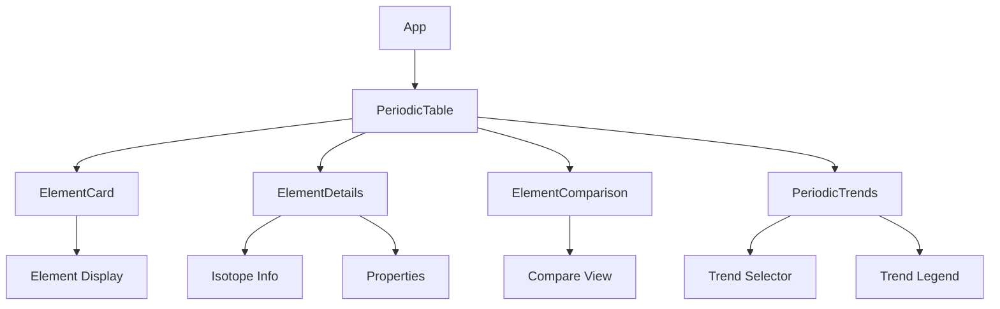
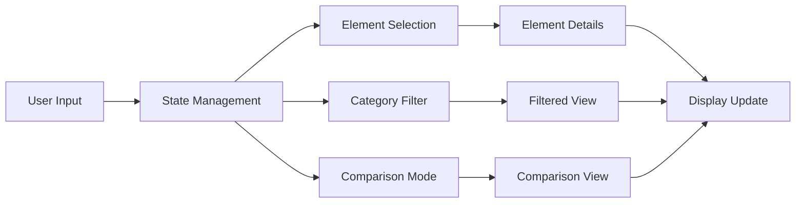
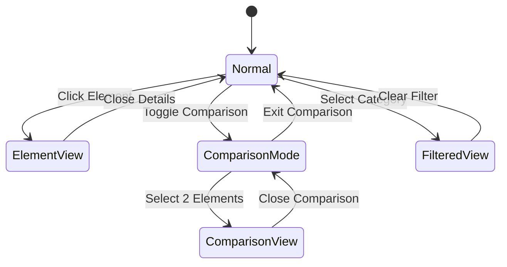
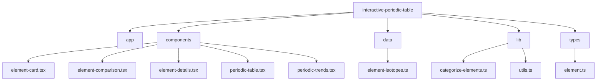
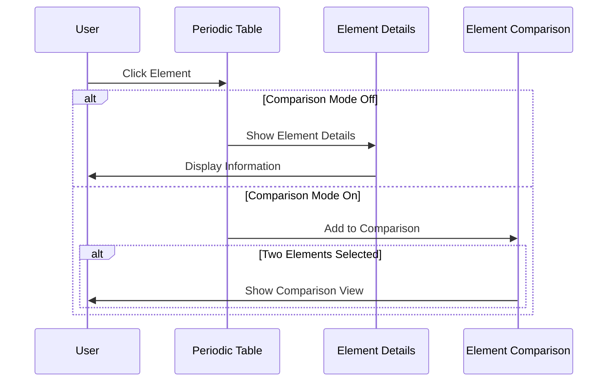
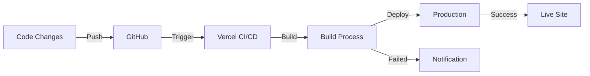

# तत्त्व चक्र (Tattva Chakra) - Interactive Periodic Table

An interactive periodic table with Indian historical theme, featuring all 118 elements with detailed isotope and radioactivity information.

[](https://vercel.com/paddyoaktreepot-gmailcoms-projects/v0-interactive-periodic-table)
[](https://v0.dev/chat/projects/HXJck1dhk6X)
[](https://www.typescriptlang.org/)

## ✨ Features

- **Interactive Element Cards**: Click on any element to view detailed information
- **Element Comparison**: Compare properties of any two elements side by side
- **Category Filtering**: Filter elements by their categories (e.g., Metals, Non-metals)
- **Periodic Trends**: Visualize various periodic trends with color-coded representations
- **Isotope Information**: Access detailed isotope and radioactivity data for each element
- **Responsive Design**: Optimal viewing experience across all device sizes
- **Dark Mode Support**: Easy on the eyes with dark mode compatibility
- **Indian Historical Theme**: Unique cultural perspective on the periodic table

## 📊 Architecture

### Component Structure


### Data Flow


### State Management


## 🚀 Technologies Used

- [Next.js](https://nextjs.org/) - React framework
- [TypeScript](https://www.typescriptlang.org/) - Type-safe JavaScript
- [Framer Motion](https://www.framer.com/motion/) - Animations
- [Tailwind CSS](https://tailwindcss.com/) - Styling
- [V0 by Vercel](https://v0.dev/) - Development platform

## 🛠️ Development

To get started with local development:

```bash
# Clone the repository
git clone https://github.com/Kedhareswer/interactive-periodic-table.git

# Navigate to the project directory
cd interactive-periodic-table

# Install dependencies
npm install

# Start the development server
npm run dev
```

Visit `http://localhost:3000` to see the application running.

## 🎯 Project Structure

### Directory Structure


## 🌟 Features in Detail

### Element Comparison
Users can select any two elements to compare their properties side by side. This feature helps in understanding the similarities and differences between elements.

### Periodic Trends
The application visualizes various periodic trends through color coding, making it easier to understand patterns across the periodic table.

### Category Filtering
Elements can be filtered by their categories, allowing users to focus on specific groups of elements like metals, non-metals, or noble gases.

### User Interaction Flow


## 🚀 Deployment

The project is automatically deployed on Vercel through continuous integration. Any changes pushed to the main branch will trigger a new deployment.

### Deployment Flow


## 📝 License

[MIT License](LICENSE)

## 🙏 Acknowledgments

- Data sources for element properties and isotopes
- [V0 by Vercel](https://v0.dev/) for development platform support
- The open-source community for various tools and libraries used in this project

## 🔗 Links

- [Live Demo](https://vercel.com/paddyoaktreepot-gmailcoms-projects/v0-interactive-periodic-table)
- [V0 Project](https://v0.dev/chat/projects/HXJck1dhk6X)
- [GitHub Repository](https://github.com/Kedhareswer/interactive-periodic-table)

---
*Last updated: 2025-06-05 14:09:44 UTC by @Kedhareswer*
